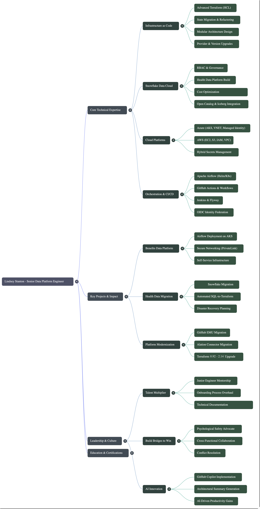

# AI-Augmented Professional Synthesis and Career Advisor

## Experiments with NotebookLM

NotebookLM is a Google-powered AI research assistant and "thinking partner" that uses the Gemini 3.0 model to analyze uploaded user documents (PDFs, websites, images) rather than general internet data. It specializes in summarizing, brainstorming, and creating content like images, audio overviews, study guides, and reports, grounded solely in your provided sources.

The data source collection utilized includes data from:

- Past performance feeback
- Personal project logs
- Technical summaries
- Personal notes
- Learning records

This project showcases artifacts that NotebookLM generated (for better or worse) based on the data provided.

